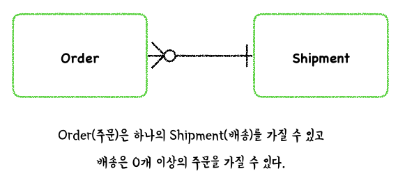

# ER Diagram
- ER 다이어그램은 높은 퀄리티로 DB를 설계하도록 돕는다.
- 데이터베이스 설계, 관리, 유지를 위해 사용된다.
- Communication의 수단이기도 하다.

## 1. ERD?
- Entity Relationship Diagram
- Entity의 관계를 다이어그램 형태로 표현
- 구조적 다이어그램(Structural Diagram) 중 하나
  - System의 Major **Entity**
  - **Inter-Relationship** among Entities

## 2. 언제 ERD를 그릴까?
- 데이터베이스의 시각화와 물리적 데이터베이스 디자인을 위해 개발됨
- 하지만 그 외에도 ERD는 다양하게 사용될 수 있다.

### 1) 데이터베이스 디자인
- 데이터베이스를 직접 조작하는 것은 위험이 따르는 일이다
- ERD를 이용하여 먼저 데이터베이스 디자인을 어떤식으로 바꿀 것인지에 관해 계획할 수 있다.
- 즉, 변화를 데이터베이스에 직접 주기 전 설계를 통해 안정성을 확인하는 것이다.

### 2) 데이터베이스 디버깅
- 데이터베이스에서 이슈를 관리하는 것은 꽤 힘든 일이다.
- 데이터베이스는 많은 테이블들을 포함하고 있고 테이블들의 요구사항도 각기 다르다.
- ERD는 테이블, 테이블 요구사항에 관한 정보를 시각적으로 담고 있기 때문에 데이터베이스 디버깅을 하기 간편하다.

### 3) 데이터베이스 생성 및 패칭
- ERD를 그리면 자동으로 데이터베이스를 생성할 수 있다.
- MySQL에서는 ERD를 테이블로 바꿔주는 작업을 지원한다.
- 테이블들과 그들의 관계를 ERD 로 바꾸어 표현해줄 수도 있다.

### 4) 요구사항 수집
- 테이블의 전체적 흐름을 담고 있고 물리적 데이터베이스로 바꿀 때의 이름에 관한 정보도 담고 있을 수 있다.
- 고객의 요구사항을 잘 표현하였는지, 놓친 것은 없는지를 직관적으로 파악할 수 있다는 장점이 있다.

## 3. ERD Notations
### 1) Entity
- 시스템 안에서 개념적인 형태이다.
- 사람, 역할, 객체, 개념, 사건 등을 테이블로 나타낼 수 있다.
- ERD에서는 테이블이라는 명칭대신 Entity로 사용한다.

### 2) Entity Attributes (구성요소)
- Primary Key: 데이테비이스 테이블에서 최소성과 유일성을 만족하는 키이다. 
  - 최소성: 키를 구성하는 열의 개수가 최소이다.
  - 유일성: 선택한 컬럼(열)에 따라 각각의 레코드를 구분할 수 있다.
  - e.g. 주민등록번호, 학번

- Foreign Key
  - 식별관계와 비식별관계를 결정짓는다.
  - 부모 테이블의 Primary Key 혹은 Unique Key를 자신의 Primary Key로 삼으면 식별 관계
  - 부모 테이블의 Primary Key 혹은 Unique Key를 외래키로서만 사용할 경우에는 비식별 관계
    - 이 때, 외래키는 Unique 할 필요는 없다. (레코드를 구분하지 않아도 된다, 여러 번 등장할 수 있다)

- Relationship
  - 두 테이블 간 어떤 관계를 형성하고 있는가
  - 1:1, 1:N, N:M의 관계가 있다.

- Cardinality
  - 1:1, 1:N, N:M

## 4. 개념적, 논리적, 물리적 데이터 모델

### 1) 개념적 데이터 모델
- 비지니스 목적으로 만드는 모델
- Entity와 Relation을 나타냄

### 2) 논리적 데이터 모델
- Entity, Relation, Column

### 3) 물리적 데이터 모델
- 관계형 데이터베이스의 실제적인 디자인 청사진
- Entity, RRelation, Column + 어떻게 데이터가 저장될 것인지에 관한 Type, Name 등에 대한 내용도 추가된다.

## 5. Data Flow Diagram(DFD)와 ERD
- 시스템 흐름도: 시스템의 과정을 다이어그램으로 나타낸 것
- DFD와 ERD를 함께 이용하여 시스템 흐름도를 구성할 수도 있음
- Business Process Model and Notation(BPMN)와 ERD를 함께 묶어 전체 시스템 흐름도를 구성할 수도 있음

[참고사이트](https://www.visual-paradigm.com/guide/data-modeling/what-is-entity-relationship-diagram/#erd-data-models-conceptual)
